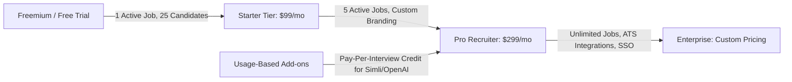

# AI-Recruit360: Competitive Analysis, Market Differentiation & FYP Defense Guide

This document provides a comprehensive market analysis, competitor comparison, business/monetization strategy, and external examination defense preparation for the BS Software Engineering Final Year Project **AI-Recruit360**.

---

## 1. Deep Breakdown of Existing Competitors

### 1. Beatview.ai
* **Core Philosophy**: A streamlined, lightweight asynchronous hiring platform designed for lean recruitment teams.
* **How It Works**:
  * AI resume screening with explainable criteria.
  * **Asynchronous (one-way) video interviews**: Candidates record video responses to pre-set static questions; AI analyzes the transcription for communication, role fit, and relevance.
  * Work style and behavioral evaluation.
  * Acts as a decision layer connecting to external ATS platforms.
* **Limitations**:
  * **One-Way Interaction**: Candidates talk into an empty screen with no visual AI interviewer or real-time adaptation.
  * **No Dynamic Hard-Skills Assessment**: Lacks a dedicated, time-bounded technical testing engine generated from candidate-specific CV projects.

### 2. iMocha (imocha.io)
* **Core Philosophy**: Enterprise skill assessment and talent analytics platform.
* **How It Works**:
  * Hosts a static library of **3,000+ pre-made tests** and 10,000+ questions across IT, coding, languages, and compliance.
  * Employs remote proctoring (camera, window violation tracking, audio analysis).
  * Focuses heavily on post-hire internal mobility, employee upskilling, and enterprise workforce planning (partners with Workday, SAP).
* **Limitations**:
  * **Static Question Banks**: Relies on standardized, textbook question pools. Questions are not dynamically synthesized for a candidate’s specific resume projects.
  * **No Conversational Interviewer**: It is a testing engine, not an interactive conversational interviewer.
  * **Enterprise Complexity & High Cost**: Expensive enterprise contracts ($10,000+/year) with high setup overhead.

### 3. HireVue (hirevue.com)
* **Core Philosophy**: The legacy enterprise pioneer in video interviewing and talent assessment.
* **How It Works**:
  * Automated pre-recorded video interviews and game-based cognitive assessments.
  * Evaluates candidates using static NLP models trained by I-O psychologists on language content and competencies.
  * Built strictly for massive volume (e.g., Fortune 500 graduate hiring programs).
* **Limitations**:
  * **Impersonal & Stressful**: Candidates widely criticize HireVue for forcing them to talk to a countdown timer on a blank screen with zero human or avatar presence.
  * **Rigid & Non-Adaptive**: Every candidate receives the exact same fixed prompts. The system cannot dynamically probe deeper into something the candidate just said.
  * **Past Controversy**: Faced intense public and regulatory backlash over historic facial emotion analysis, forcing them to roll back computer vision models to purely text/transcript evaluation.

### 4. Other Notable Market Competitors
* **Apriora ("Alex")**: Offers an autonomous AI recruiter that conducts live, 2-way conversational phone/video calls. However, it lacks an integrated candidate-tailored technical MCQ screening step and does not provide an open, transparent multi-stage scoring formula.
* **Vervoe**: Replaces resumes with realistic job simulations (written/coding tasks) graded by AI, but skips conversational video interaction.
* **TestGorilla / HackerRank**: Standalone technical testing tools, but they do not provide AI resume screening or conversational avatar interviews.

---

## 2. Feature Comparison Matrix

| Feature Dimension | **AI-Recruit360 (Your FYP)** | **Beatview.ai** | **iMocha** | **HireVue** | **Apriora** | **TestGorilla** |
| :--- | :---: | :---: | :---: | :---: | :---: | :---: |
| **Unified 3-Tier Funnel** (CV $\rightarrow$ MCQ $\rightarrow$ Interview) | **Yes (All-in-One)** | Partial (No MCQ) | No (Test only) | Partial (Video+Games) | No (Interview only) | No (Test only) |
| **CV Screening Mechanism** | Evidence-quote extraction with strict threshold | Score ranking | Keyword/profile parsing | Resume matching | Resume parsing | None |
| **Technical Assessment** | **Dynamic Personalized MCQs** (synthesized from CV + Job) | None / Work style | Static 3000+ Test Bank | Pre-set cognitive tests | None | Static Test Library |
| **Server-Side Integrity** | **PostgreSQL atomic timers & serialization** | Basic timeouts | Audio/Video proctoring | Browser lock | N/A (Live call) | Browser proctoring |
| **Interview Format** | **Live Talking Avatar (Simli + Nova TTS)** | One-way video recording | One-way video | One-way video recording | 2-way video/audio agent | One-way video |
| **Interview Adaptability** | **5-Stage Progressive Probing** (adapts to prior answers) | Static questions | Static questions | Static questions | Adaptive conversational | Static questions |
| **Scoring Explainability** | **Deterministic Formula** (40% CV + 25% MCQ + 35% Int.) | Black-box AI | Score percentile | Proprietary NLP | AI score sheet | Test percentage |
| **Candidate Experience** | Interactive Avatar / No account required | Blank screen recording | Standard form tests | Blank screen recording | Conversational AI | Standard test form |
| **Target Audience** | SMBs, Startups, Mid-Market | Lean hiring teams | Global Enterprises | Fortune 500 Enterprises | Mid-to-Enterprise | SMB to Mid-Market |

---

## 3. What Makes AI-Recruit360 Novel & Better?

When examiners ask: *"Why did you build this when HireVue, iMocha, and Beatview already exist?"*, highlight these four architectural differentiators:

### 1. The Unified Multi-Stage Funnel (Eliminating Tool Fragmentation)
* **Industry Reality**: Most companies currently subscribe to 3 separate tools: one ATS for resume screening, another (e.g., TestGorilla or iMocha) for technical tests, and a third (e.g., HireVue) for video interviews.
* **AI-Recruit360 Advantage**: Integrates the entire recruitment funnel into a single coherent system. A candidate applies, receives immediate evidence-grounded screening, transitions seamlessly into a personalized 10-question MCQ assessment, and steps into an adaptive avatar interview room—all under a single signed session.

### 2. Context-Aware Dynamic MCQs vs. Stale Static Question Banks
* **Industry Reality**: Competitors like iMocha and TestGorilla rely on pre-written question banks. Candidates routinely find leaked answers on Brainly, Quizlet, and Reddit.
* **AI-Recruit360 Advantage**: Questions are generated dynamically by analyzing the intersection of the candidate’s specific CV projects and the job requirements. If a candidate claims they built a distributed cache in Redis, the assessment generates non-trivia MCQs targeting their exact architecture, making pre-cheating impossible.

### 3. Real-Time Conversational Avatar vs. Awkward One-Way Video
* **Industry Reality**: Asynchronous video interviews (HireVue/Beatview) have an 80%+ candidate dissatisfaction rating because candidates speak into a camera with a countdown clock, feeling like they are talking to a void.
* **AI-Recruit360 Advantage**: An interactive avatar (powered by Simli and OpenAI `nova` TTS) speaks the questions, providing natural humanized facial cues and voice synthesis. It transforms a cold recording into an engaging, professional interview experience.

### 4. Deterministic, Auditable Scoring vs. Black-Box Magic
* **Industry Reality**: Enterprise AI hiring platforms often hide behind black-box ML models that cannot explain why candidate A received an 82 while candidate B received a 68, creating severe regulatory liabilities (EU AI Act, NYC Local Law 144).
* **AI-Recruit360 Advantage**: Strict, explainable weighted formula:
  $$\text{Final Score} = (\text{CV Score} \times 0.40) + (\text{Assessment Score} \times 0.25) + (\text{Interview Score} \times 0.35)$$
  Every score is backed by database-persisted evidence: exact CV quotes, MCQ answer logs with millisecond timestamps, and per-question interview response evaluations.

---

## 4. Business & Monetization Model

Examiners frequently ask: *"How will you monetize this?"* or *"What is the business model?"* Present a realistic SaaS model tailored for SMBs and mid-market organizations:

### 1. Subscription Tiers (B2B SaaS)
* **Starter Tier ($99/month)**: Ideal for early-stage startups. 3 active job postings, automated CV screening, standard MCQs, typed interview responses.
* **Growth / Pro Tier ($299/month)**: 10 active job postings, dynamic project-based MCQ generation, full Avatar video interview (Simli + TTS audio), recruiter collaboration seats.
* **Enterprise Tier (Custom / $999+/month)**: Custom candidate capacity, dedicated database tenant, ATS webhook integrations (Greenhouse, Lever, Workday), custom branded career portals.

### 2. Usage-Based Credit Model (Margin Protection)
* Third-party AI API calls (OpenAI GPT-4o-mini, Whisper, Simli streaming, TTS) incur direct operational costs (approximately $0.40–$0.80 per full candidate journey).
* The platform can charge **$3.00 to $5.00 per completed candidate pipeline**, yielding an **80%+ gross margin** while remaining vastly cheaper than HireVue (which costs $15,000–$40,000 annually).

---

## 5. Comprehensive FYP Defense Q&A Preparation

These answers will help you address tough, realistic questions from external examiners, professors, and technical judges:

---

### Category A: Motivation & Problem Statement

#### Q1: "Why did you choose to build this project? Isn't hiring already solved by job boards like LinkedIn and Indeed?"
> **Examiner Intent**: Testing whether you understand the real-world industry bottleneck or just built a generic project.
>
> **Model Answer**:
> *"LinkedIn and Indeed only solve candidate sourcing—they do not solve candidate evaluation. In fact, one-click applications on LinkedIn have created a crisis for recruiters: a single software engineering posting receives 500 to 1,500 applications within 48 hours, over 70% of which are unqualified or AI-generated resume spam. Recruiters spend an average of only 6 to 7 seconds scanning a resume, leading to high false-negative rates and human fatigue. 
> 
> We created AI-Recruit360 to automate the evaluation bottleneck. It doesn't just store resumes; it thoroughly reads the CV evidence, generates a personalized 10-question skills assessment, and conducts an adaptive interview with an AI avatar. It converts days of manual screening into a qualified, audit-ready scorecard in minutes."*

---

### Category B: Technical Architecture & Novelty

#### Q2: "Why generate personalized MCQs instead of using an existing question bank like iMocha or TestGorilla?"
> **Examiner Intent**: Probing your technical depth and understanding of cheating/evaluation integrity.
>
> **Model Answer**:
> *"Static question banks suffer from three critical flaws:
> 1. **Academic leakage**: Standardized questions are rapidly leaked and shared on platforms like GitHub, Reddit, and Brainly.
> 2. **Irrelevance**: A generic 'Python test' often tests trivial syntax or obscure built-in methods rather than how the candidate applies Python to their real projects.
> 3. **Candidate resentment**: Senior candidates find generic textbook questions disrespectful of their experience.
> 
> AI-Recruit360 analyzes the candidate's actual resume text alongside the job description. If a candidate claims experience designing high-concurrency microservices with FastAPI, our AI engine synthesizes 10 non-trivia questions challenging that exact architectural scope. Because the questions are generated on demand, they cannot be pre-memorized or looked up."*

#### Q3: "What prevents a candidate from using ChatGPT in another window to cheat on your assessment?"
> **Examiner Intent**: Testing system security, timing controls, and cheating countermeasures.
>
> **Model Answer**:
> *"We enforce multi-layered server-side integrity:
> 1. **Strict Server-Side Deadlines**: Timing is not enforced by client JavaScript (which can be manipulated in DevTools). The presented timestamp is recorded in PostgreSQL via our `record_assessment_answer` RPC. Each question has a strict 60-second limit plus a 5-second network delivery grace period. Late answers are marked as timed out.
> 2. **Question Serialization**: Questions are presented strictly one at a time. The database checks that question $N-1$ has a saved answer before question $N$ can be presented.
> 3. **Bounded Time Constraint**: 60 seconds is insufficient to copy a complex scenario question, feed it to an LLM, read the explanation, and select the correct option.
> 4. **Sequential Verification in the Interview**: In Tier 3, the AI interviewer conducts an adaptive CV deep-dive, asking conversational follow-ups on the same concepts tested in the assessment."*

---

### Category C: AI, Avatar & Machine Learning

#### Q4: "What is the role of the avatar? Is it just decorative eye candy?"
> **Examiner Intent**: Checking if you added Simli just for show or if there is pedagogical/UX justification.
>
> **Model Answer**:
> *"The avatar serves a crucial psychological and operational purpose. Studies on asynchronous one-way video interviews (like HireVue) consistently report severe candidate anxiety and cognitive disconnect caused by speaking into an empty screen with a countdown timer. 
> 
> By integrating Simli with OpenAI's natural TTS voice (`nova`), we provide an empathetic visual presence. The candidate sees a synchronized face speaking the question, which mimics the cadence of a real human interview. Furthermore, it enforces structured pacing: the avatar reads the question aloud, during which recording is held, establishing a professional interview atmosphere."*

#### Q5: "How do you handle LLM hallucinations or non-deterministic scoring?"
> **Examiner Intent**: Assessing your knowledge of LLM reliability and engineering safeguards.
>
> **Model Answer**:
> *"We address hallucination through three architectural choices:
> 1. **Structured Outputs with Pydantic**: We do not use free-form text completions. We enforce strict JSON schemas via OpenAI Structured Outputs (`chat.completions.parse`), guaranteeing required data types, ranges, and structures.
> 2. **Grounded Prompts & Untrusted Input Isolation**: Candidate resume text and answers are explicitly tagged as untrusted evidence in the system prompt. The model is instructed to extract verifiable evidence quotes rather than inferring unstated competencies.
> 3. **Deterministic Score Aggregation**: The final hiring recommendation is not generated by an arbitrary LLM prompt. It is computed deterministically in our backend using a strict mathematical formula: 40% CV + 25% Assessment + 35% Interview. The AI evaluates individual answers, but the composite score and threshold decisions are purely algorithmic."*

---

### Category D: Bias, Ethics & Legal Regulations

#### Q6: "AI in recruitment is notorious for bias (e.g., Amazon’s scrapped hiring tool). How does your system ensure fairness?"
> **Examiner Intent**: Testing your awareness of AI ethics, EEOC, and the EU AI Act.
>
> **Model Answer**:
> *"AI-Recruit360 is built around three core fairness principles:
> 1. **No Demographic or Facial Sentiment Analysis**: Unlike older platforms that attempted to analyze facial micro-expressions or vocal tonality (which introduce racial and gender bias), our evaluation is based strictly on the text content of what the candidate answers and demonstrates.
> 2. **Equal Evaluation Criteria**: Every candidate applying for a job is evaluated against the exact same role-specific competencies, and all scores are anchored by required quotes and explanations.
> 3. **Human-in-the-Loop**: The platform does not make autonomous hiring decisions. The AI provides a consolidated evidence scorecard with explicit strengths and gaps; the final decision to shortlist, hire, or reject is executed solely by human recruiters."*

---

## 6. Summary Checklist for Defense Day

1. **Be Proud of the Full-Stack Engineering**: You built a Next.js 16 frontend, a decoupled FastAPI microservice, and 8 PostgreSQL migration layers with atomic transactional RPCs.
2. **Emphasize Real Data Flow**: Your system doesn't fake anything. When an assessment is submitted, real PostgreSQL rows lock, timers evaluate, and live AI requests parse candidate input.
3. **Know the Formula Cold**: Remember $0.40 \times \text{CV} + 0.25 \times \text{Assessment} + 0.35 \times \text{Interview}$. Explain why each weight makes sense (CV filters baseline fit, MCQ tests core hard knowledge, Interview assesses technical depth and communication).
