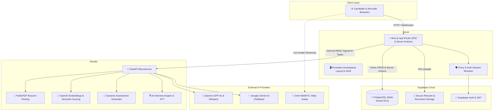
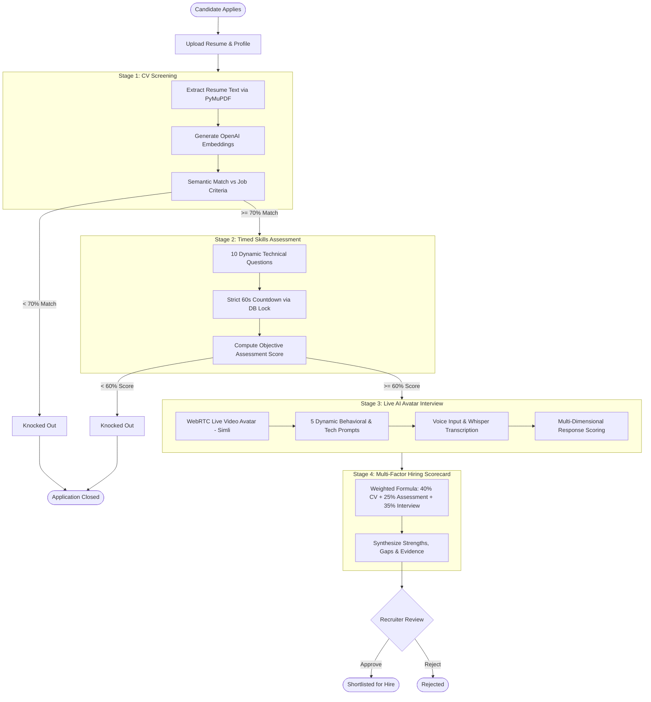

<p align="center">
  
</p>

<h1 align="center">AI-Recruit360</h1>

<p align="center">
  <strong>Autonomous AI-Powered Recruitment Workspace & Multi-Stage Candidate Evaluation Platform</strong>
</p>

<p align="center">
  
  
  
  
  
  
  
  
</p>

---

## 📌 Overview

**AI-Recruit360** is an enterprise-grade, multi-tenant recruitment intelligence platform designed as a BS Software Engineering Final Year Project (FYP). It automates the end-to-end talent acquisition lifecycle:

1. **Intelligent Resume Screening:** Extracts unstructured text from PDF/DOCX resumes, maps skills against job requirements, and computes semantic vector match scores.
2. **Anti-Cheating Timed Skills Assessment:** Dynamically generates targeted technical questions enforced with strict database-level countdown deadlines.
3. **Interactive AI Avatar Interviews:** Conducts voice- and video-driven candidate interviews using a live conversational avatar (Simli + WebRTC) and speech recognition (Whisper).
4. **Autonomous Hiring Scorecards:** Synthesizes candidate performance across all three stages using a weighted multi-factor formula (**40% CV + 25% Assessment + 35% Interview**) with detailed strength/weakness evidence for recruiter decision-making.

---

## 🏛️ System Architecture

AI-Recruit360 separates high-speed transactional CRUD and multi-tenant security (Next.js + Supabase) from heavy AI processing pipelines (FastAPI + LangGraph + OpenAI):



---

## 🔄 3-Stage Candidate Evaluation Pipeline



---

## ⚡ Engineering & Performance Highlights

* **Persistent Workspace Layout (`app/(workspace)/layout.tsx`):**
  Moved the recruiter chrome (`ApplicationShell`, sidebar, navigation, workspace switcher) to a shared Next.js Route Group layout. Switching between tabs (**Overview → Jobs → Applications → Candidates → Interviews → Evaluations → Analytics**) does not unmount or rebuild the DOM.
* **Optimized Middleware (`proxy.ts`):**
  Eliminated redundant database roundtrips by verifying active workspace cookies (`air360_org_id`) and injecting verified user headers downstream. Middleware execution dropped from **1,735ms to ~290ms** (~82% reduction).
* **Multi-Tenant Row-Level Security (RLS) Indexes:**
  Custom B-tree indexes on `organization_members(user_id)`, `organization_members(organization_id, user_id)`, and application foreign keys accelerate multi-tenant policy checks across all queries.
* **Granular Suspense Streaming:**
  Pages load instant loading skeletons while server data streams concurrently via React 19 Suspense boundaries.
* **Direct Database CRUD:**
  Standard recruiter actions talk directly to Supabase via `@supabase/ssr`, avoiding redundant backend-to-backend hops. FastAPI is dedicated strictly to heavy AI workloads.

---

## 🛠️ Technology Stack

| Layer | Technologies | Purpose |
| :--- | :--- | :--- |
| **Frontend UI** | Next.js 16 (App Router), React 19, TypeScript | Server Components, Server Actions, Client Shell |
| **Styling** | Tailwind CSS, Lucide React, Glassmorphism design | Modern, responsive, dark-mode ready recruitment dashboard |
| **Backend AI** | FastAPI, Python 3.12, Pydantic v2, Uvicorn | High-concurrency async AI microservice |
| **Database & Auth** | Supabase (PostgreSQL 15), Supabase Auth | Multi-tenant RLS isolation, session management, signed storage |
| **AI & NLP** | OpenAI (GPT-4o, text-embedding-3-small, Whisper) | Resume analysis, assessment generation, speech recognition |
| **Interview Avatar** | Simli Client (WebRTC), LiveKit | Real-time interactive AI video & audio avatar interviewer |
| **Document Processing** | PyMuPDF (fitz), Mammoth | Fast PDF and DOCX resume extraction |

---

## 📁 Repository Structure

```text
AI-Recruit360/
├── frontend/                     # Next.js 16 App Router Frontend
│   ├── app/
│   │   ├── (workspace)/          # Persistent Recruiter Dashboard Route Group
│   │   │   ├── layout.tsx        # Persistent ApplicationShell & TopBar
│   │   │   ├── loading.tsx       # Content-area Suspense skeleton
│   │   │   ├── dashboard/        # Workspace Overview & Metrics
│   │   │   ├── jobs/             # Job creation & management
│   │   │   ├── applications/     # Candidate pipeline kanban & lists
│   │   │   ├── candidates/       # Candidate directory & detail profiles
│   │   │   ├── interviews/       # AI Interview rooms & logs
│   │   │   ├── evaluations/      # Multi-factor scorecards & recommendations
│   │   │   ├── analytics/        # Hiring funnel & velocity analytics
│   │   │   └── settings/         # Workspace preferences & security
│   │   ├── apply/[job-slug]/     # Public candidate job application portal
│   │   ├── assessment/           # Candidate anti-cheating timed testing room
│   │   ├── interview-room/       # Candidate live AI avatar interview room
│   │   └── proxy.ts              # High-performance Next.js auth & routing middleware
│   ├── components/               # Reusable UI controls, cards, and modals
│   ├── lib/
│   │   ├── auth/                 # Session resolution & organization context
│   │   ├── services/             # Supabase data services
│   │   └── supabase/             # Browser and Server SSR Supabase clients
│   └── providers/                # AuthProvider & BreadcrumbProvider
│
├── ai-service/                   # FastAPI Python AI Microservice
│   ├── app/
│   │   ├── api/routes/           # API endpoints (screening, assessments, interviews)
│   │   ├── core/                 # App configuration, security, & rate limiters
│   │   ├── providers/            # OpenAI & Gemini provider adapters
│   │   └── services/
│   │       ├── screening/        # CV parsing, embedding, & criteria matching
│   │       ├── assessment/       # Dynamic question generator & validator
│   │       └── interview/        # Interview question prompter & scoring
│   ├── requirements.txt          # Python dependencies
│   └── tests/                    # Pytest test suite
│
├── supabase/
│   ├── migrations/               # PostgreSQL schema, RLS policies, & stored functions
│   │   ├── 01_schema.sql         # Base multi-tenant schema & RLS policies
│   │   ├── 02_data_contract.sql  # Pipeline state constraints & indexes
│   │   └── 09_performance_indexes.sql # RLS & foreign-key B-tree indexes
│   └── README.md                 # Migration setup documentation
│
├── render.yaml                   # Render deployment blueprint for ai-service
└── README.md                     # Project documentation
```

---

## 🚀 Getting Started

### Prerequisites
* **Node.js** 20.x or 22.x
* **Python** 3.12+
* **Supabase** account (Free tier supported)
* **OpenAI API Key** (for GPT-4o, embeddings, & Whisper)

---

### 1. Database Setup (Supabase)
1. Create a new project in [Supabase](https://supabase.com).
2. Go to **SQL Editor** and run the migrations in sequential order from `supabase/migrations/`:
   - `01_schema.sql` through `09_performance_indexes.sql`.
3. In **Storage**, ensure the `resumes` bucket is created with private access.
4. In **Authentication → URL Configuration**, add `http://localhost:3000/auth/callback` to **Redirect URLs**.

---

### 2. AI Microservice Setup (`ai-service`)
```bash
# Navigate to the ai-service directory
cd ai-service

# Create and activate a virtual environment
python -m venv .venv
# On Windows:
.venv\Scripts\activate
# On macOS/Linux:
source .venv/bin/activate

# Install dependencies
pip install -r requirements.txt

# Create your .env file
cp .env.example .env
```

Configure `ai-service/.env`:
```ini
ENVIRONMENT=development
OPENAI_API_KEY=sk-...
SUPABASE_URL=https://your-project.supabase.co
SUPABASE_SERVICE_ROLE_KEY=eyJhbGciOi...
AI_SERVICE_SHARED_SECRET=your-secure-random-32-char-secret
ALLOWED_ORIGINS=http://localhost:3000
```

Start the FastAPI server:
```bash
uvicorn app.main:app --host 127.0.0.1 --port 8000 --reload
```
*Health Check:* `http://127.0.0.1:8000/api/v1/health`

---

### 3. Frontend Setup (`frontend`)
```bash
# Navigate to the frontend directory
cd frontend

# Install packages
npm install

# Create your .env.local file
cp .env.example .env.local
```

Configure `frontend/.env.local`:
```ini
NEXT_PUBLIC_SUPABASE_URL=https://your-project.supabase.co
NEXT_PUBLIC_SUPABASE_ANON_KEY=eyJhbGciOi...
SUPABASE_SERVICE_ROLE_KEY=eyJhbGciOi...
AI_SERVICE_URL=http://127.0.0.1:8000/api/v1
AI_SERVICE_SHARED_SECRET=your-secure-random-32-char-secret
CANDIDATE_SESSION_SECRET=your-random-candidate-session-secret
NEXT_PUBLIC_APP_URL=http://localhost:3000

# Optional Simli Avatar
SIMLI_API_KEY=your-simli-api-key
SIMLI_FACE_ID=your-simli-face-id
```

Run the development server:
```bash
npm run dev
```

Open [http://localhost:3000](http://localhost:3000) in your browser.

---

## 🌐 Production Deployment

| Service | Recommended Platform | Configuration |
| :--- | :--- | :--- |
| **Frontend** | **Vercel** | Set Root Directory to `frontend`, add environment variables, and deploy. |
| **AI Service** | **Render** | Use pre-configured `render.yaml` (Free Web Service), Python 3.12 runtime. |
| **Database** | **Supabase** | Cloud PostgreSQL with RLS and automated backups. |

> **Pro-Tip for Render Free Tier:** Render spins down free web services after 15 minutes of inactivity. Set up a free 10-minute ping using [cron-job.org](https://cron-job.org/) or [UptimeRobot](https://uptimerobot.com/) pointing to `https://your-backend.onrender.com/api/v1/health` to keep the Python AI engine warm 24/7.

---

## 🧪 Testing & Verification

Run the comprehensive test suite:

```bash
# 1. Typecheck and lint frontend
npm --prefix frontend run typecheck
npm --prefix frontend run lint

# 2. Test production build
npm --prefix frontend run build

# 3. Run AI service unit & integration tests
cd ai-service
pytest tests/ -v
```

---

## ⚖️ Final Score Calculation

The candidate's cumulative score is derived from transparent, multi-factor weighting:

$$\text{Final Score} = (\text{CV Score} \times 0.40) + (\text{Assessment Score} \times 0.25) + (\text{Interview Score} \times 0.35)$$

- **CV Screening:** Minimum 70% threshold required to unlock Assessment.
- **Skills Assessment:** Minimum 60% threshold required to unlock Interview.
- **Final Evaluation:** Evidence-based breakdown including AI-identified strengths, flagged gaps, and verified candidate answers.

---

## 👨‍💻 Author & Final Year Project Information

* **Degree:** Bachelor of Science in Software Engineering (BS SE)
* **Project:** AI-Recruit360 — FYP 2.0
* **Repository:** [AI-Recruit360-FYP-2.0](https://github.com/AmeerHxmza/AI-Recruit360-FYP-2.0)

---

<p align="center">
  <sub>Built with ❤️ using Next.js 16, FastAPI, Supabase, and OpenAI.</sub>
</p>